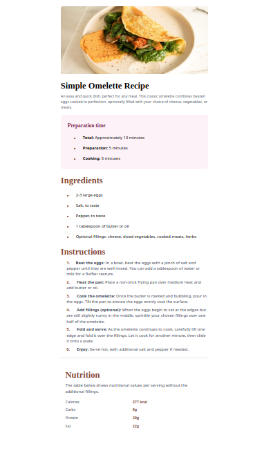

# Frontend Mentor - Recipe page solution

This is a solution to the [Recipe page challenge on Frontend Mentor](https://www.frontendmentor.io/challenges/recipe-page-KiTsR8QQKm). 

### Screenshot

### Built with

- Semantic HTML5 markup
- CSS custom properties
- Flexbox
- Desktop-first workflow
- [React](https://reactjs.org/) - JS library
- [Next.js](https://nextjs.org/) - React framework
- [Tailwind css](https://v3.tailwindcss.com/) - For styles

## Author

- Website - [Mesud ahmed](https://my-portfolio-kappa-lyart-53.vercel.app/)
- Frontend Mentor - [@mesudahmed](https://www.frontendmentor.io/profile/Mesud-Ahmed)

